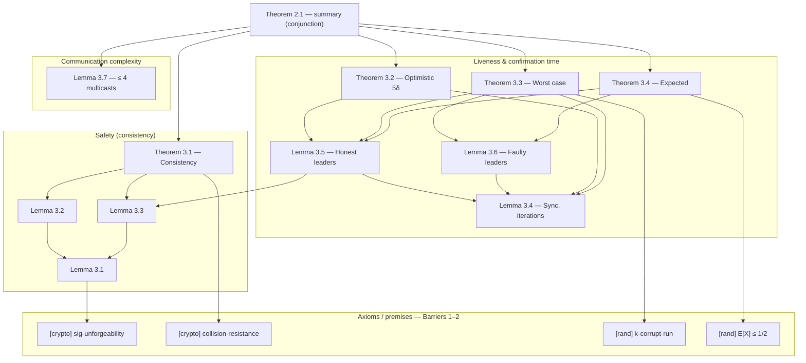

# simplex-fv

Formal-verification notes and reference material for the **Simplex** consensus
protocol.

## Source

Benjamin Y. Chan, Rafael Pass —
*Simplex Consensus: A Simple and Fast Consensus Protocol*

- IACR ePrint: <https://eprint.iacr.org/2023/463> (version dated 2023-06-01)
- Published at Theory of Cryptography Conference (TCC) 2023
- Intro site: <https://simplex.blog/>

Victor Shoup's *Sing a Song of Simplex* ([ePrint 2023/1916](https://eprint.iacr.org/2023/1916),
DISC 2024) is a related latency optimization of the same protocol and is
**out of scope** for these notes.

> The source PDF is **not** committed to this repository. Download it from the
> link above and place it at `2023-463.pdf` if you want the local copy that the
> notes reference (SHA-256
> `d832a015b91d208f53384826ca080c7e8288b58a0cd71da208abd2030b82da84`).

## Contents

The per-statement paper notes (every numbered Theorem and Lemma — Theorem 2.1,
3.1–3.4; Lemma 3.1–3.7 — each with its proof, a notation glossary, and
one-file-per-item segments) are **maintained separately, outside this
repository**, and are no longer version-controlled here. The paper defines **no**
numbered Definitions, Propositions, or Corollaries — the model lives in unnumbered
§2 prose.

The protocol pseudocode (the §2.1 player steps), Figures 1–2, the §2.2 proof
outline, and the §3.4 communication-complexity discussion beyond Lemma 3.7 are
intentionally omitted — they are protocol description and commentary rather than
statements to formalize.

## Goal

Build toward a machine-checked formalization of the Simplex consistency
(safety) and liveness results, using the extracted statements as the
specification target. The Lean 4 approach is recorded in the
[Formalization strategy](#formalization-strategy) section below.

## Formalization strategy

This section records *how* the Simplex consensus protocol (IACR ePrint 2023/463)
is being formalized in Lean 4, the technical barriers we hit, and the explicit
policy decision for each, covering the 12 numbered statements of the paper
(Theorem 2.1, 3.1–3.4; Lemma 3.1–3.7).

Simplex is deliberately simple: a partially-synchronous BFT protocol whose entire
safety argument is one quorum-intersection lemma applied twice, and whose liveness
argument is a short timing analysis plus a coin-flipping bound on leader rotation.
There is **no VRF lottery, no Chernoff concentration, and no ebb-and-flow / sleepy
model** — so the probabilistic surface is far smaller than in protocols like
Goldfish.

### Barriers and decisions

#### 1. Idealized cryptography (signatures, hashes)

Simplex assumes a bare PKI + unforgeable digital signatures and a publicly known
**collision-resistant hash** `H` (parent-chain linking). Lemma 3.1 is *literally*
"by a direct reduction to the unforgeability of the signature scheme", and
Theorem 3.1's prefix conclusion is closed by collision resistance of `H`.

Game-based cryptographic reductions are research-level work and out of scope.

**Decision.** Axiomatize idealized interfaces: `SignatureUnforgeable` (no honest
process sees a valid `⟨m⟩_i` unless `i` signed `m`) and `CollisionResistant`
(equal hashes ⇒ equal pre-images, on the reachable block space). Declare each as
an `axiom` with a source comment in a central module. The deterministic
statements take these as hypotheses and are fully proved.

#### 2. Random leader election and probabilistic liveness

Leaders are picked by a public hash, `L_h := H*(h) mod n` (random oracle / CRS),
so each iteration's leader is honest with independent probability `(n−f)/n ≥ 2/3`.
Two liveness statements depend on this:

- **Theorem 3.3 (worst-case):** the probability of `k` consecutive corrupt
  leaders is `< (m(λ)−k+1)/2^k`, negligible once `k = ω(log λ)`.
- **Theorem 3.4 (expected):** with `X` the offset to the next honest leader,
  `E[X] ≤ 1/2` (a geometric-tail expectation).

These are elementary independent-coin bounds — **no Chernoff machinery**, unlike
Goldfish.

**Decision.** Model the per-iteration leader as an abstract oracle whose only
exposed property is "honest with independent probability `≥ (n−f)/n`". Thread the
two probability facts above as hypotheses (or small local `axiom`s) into
Theorems 3.3 and 3.4; the deterministic "honest leader ⇒ progress" core
(Lemmas 3.4–3.6) is fully proved. The measure-theoretic proof of the coin bounds
is a separate follow-up that never blocks dependents.

#### 3. Quorum intersection (the safety core)

Both safety lemmas reduce to: among `n` processes with `< n/3` corrupt, two sets
of `≥ 2n/3` signers cannot be "good" for two conflicting messages, because an
honest process signs at most one. This is pure finite combinatorics.

**Decision.** Prove it directly over `Finset` cardinalities, **without baking in
`n = 3f + 1`**. Parameterize by `n`, `f`, and the hypothesis `3 * f < n`, with
the quorum threshold expressed as `⌈2n/3⌉` (handle the integer rounding
explicitly via `Nat`/`ceil`, not by assuming divisibility). The reusable lemma is

```lean
-- any two ⌈2n/3⌉-quorums share an honest process
lemma quorum_intersect_honest
    {n f : ℕ} (hf : 3 * f < n)
    (Q₁ Q₂ : Finset (Fin n)) (honest : Finset (Fin n))
    (h₁ : (2 * n + 2) / 3 ≤ Q₁.card) (h₂ : (2 * n + 2) / 3 ≤ Q₂.card)
    (hc : honestᶜ.card ≤ f) :
    ∃ p ∈ Q₁ ∩ Q₂, p ∈ honest := by ...
```

No axiom; this is the deterministic heart of Lemmas 3.2 and 3.3.

#### 4. Protocol mechanics (iterations, timers, notarize/finalize, dummy blocks)

The notes omit the player-step pseudocode, but the statements need the iteration
loop, the `3∆` timer `T_h`, notarization/finalization (`≥ 2n/3` votes), and the
dummy block `⊥_h`.

**Decision.** Do not implement the steps operationally. Provide the voting,
timer, notarization, and finalization behaviour as an **abstract interface (a
structure / typeclass of hypotheses)** and derive the theorems from it. An
executable state-machine model can replace the interface later without changing
the theorem statements.

#### 5. Partial-synchrony timing model

Lemmas 3.4–3.6 and Theorems 3.2–3.3 are timing arguments over `GST`, the actual
delay `δ`, and the timeout parameter `∆` (`δ < ∆`), with claims of the form
"every honest process has entered iteration `h` by time `t + …`".

**Decision.** Model time as `ℝ≥0` (or `ℕ` rounds) with `GST`, `δ`, `∆` as
parameters and the message-delivery / timer rules as abstract hypotheses
(`δ`-bounded delivery after `GST`, timer fires after `3∆`). The timing lemmas are
then ordinary inequality reasoning, fully proved.

### Result categories and dependency graph

Three categories — `safety`, `liveness`, and `complexity`.
The safety line is self-contained given the crypto axioms; the liveness line
depends on the timing model and leader randomness; complexity is a single lemma.

- **Safety (consistency):** Lemma 3.1–3.3, Theorem 3.1. Quorum
  intersection ⇒ no two conflicting blocks notarized ⇒ prefix agreement.
- **Liveness & confirmation time:** Lemma 3.4–3.6, Theorem 3.2–3.4.
  Synchronized iterations + honest/faulty-leader effects ⇒ optimistic `5δ`,
  worst-case `4δ + ω(log λ)·(3∆+δ)`, expected `3.5δ + 1.5∆`.
- **Communication complexity:** Lemma 3.7 (≤ 4 multicasts per
  iteration per honest process). Independent of the safety and liveness lines.
- **Theorem 2.1** is the paper's summary statement; it has no separate proof and
  closes once the safety, liveness, and complexity statements close (it is the
  conjunction of their conclusions).

In the graph below, an edge `A --> B` reads "**A's proof depends on B**". The
`[crypto]` and `[rand]` nodes are the axioms / premises of Barriers 1 and 2. The
graph is a **DAG** — there is no cyclic dependency (contrast Goldfish's healing
induction) — so statements can be closed in topological order.



`Lemma 3.4` and `Lemma 3.7` are leaves (no in-graph dependencies).
